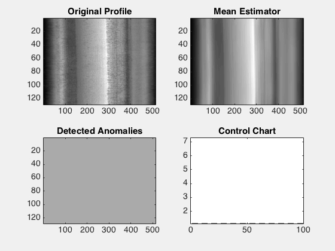

This is a Python version of the code for paper "Real-time monitoring of high-dimensional functional data streams via spatio-temporal smooth sparse decomposition" with [paper link](https://www.tandfonline.com/doi/full/10.1080/00401706.2017.1346522?casa_token=AOHd8q-gCqQAAAAA:xo2SeZ8VcB9PY84LQhK48NB9UWDr-3_P0vjUba88vA5C6heBwd4bT0kUwzpouout7P0QWllEo5Q)

If you like to use the code, please cite my paper with citation information in [bibtex format](https://scholar.googleusercontent.com/scholar.bib?q=info:3FmbKTPuVSkJ:scholar.google.com/&output=citation&scisdr=CgXj1mWGENOBtVW_ILA:AAGBfm0AAAAAXb-6OLDdla-Q41Ax0eUvGXjMLBeKx4c_&scisig=AAGBfm0AAAAAXb-6OAwFGQK6IUNXnxAMCTtWURKSPuJA&scisf=4&ct=citation&cd=-1&hl=en) or [endnote format](https://scholar.googleusercontent.com/scholar.enw?q=info:3FmbKTPuVSkJ:scholar.google.com/&output=citation&scisdr=CgXj1mWGENOBtVW_ILA:AAGBfm0AAAAAXb-6OLDdla-Q41Ax0eUvGXjMLBeKx4c_&scisig=AAGBfm0AAAAAXb-6OAwFGQK6IUNXnxAMCTtWURKSPuJA&scisf=3&ct=citation&cd=-1&hl=en)

Related Repo: [Matlab version](https://github.com/hyan46/STSSD)
Related work: Anomaly Detection in Images with Smooth
Background Via Smooth-Sparse Decomposition with [paper link](https://www.researchgate.net/profile/Hao_Yan4/publication/283520589_Anomaly_Detection_in_Images_with_Smooth_Background_Via_Smooth-Sparse_Decomposition/links/57a87b3508aed76703f63e1a/Anomaly-Detection-in-Images-with-Smooth-Background-Via-Smooth-Sparse-Decomposition.pdf) and [code](https://github.com/hyan46/SSD). 

Here are two examples

Data: 
1. `data.mat`, solar flare dataset

Function description: 

1. `bsplineBasis`: Function to generate bsplineBasis with `k` Bspline Basis and `n` gridded with spline degree `sd`  and boundary degree `bd`
   - By default $bd = sd - 1$
   - Normally, we use cubic B-spline, where $sd = 3$

2. `chartIC`: Compute the IC chart based to normalize the monitoring statistics, remember the mean in `mt2` and standard deviation `sd`. Finally, store the normalized statistics with the largest detection power in `Ttr` and the index in `Itr`.

3. `chartoc`: Based on the `mt2` and `sd` computed in `chartIC` , computed the normalized test statistics with the largest detection power `Ttr` and the index `Itr`

4. `ewmamonit`: the major function proposed in the original paper: 

   - Input variables
     - `Y`: Tensor to be monitored, currently only support 3-mode tensor. By default, the first 2 dimensions are spatio-dimension and the last is the temporal dimension. For other dimension of `Y`, need to further add a case length(Bs) == 1 to make it work.
     - `B`: Basis for the background, should be a cell with length 2. B{1} for the 1st spatial dimension of the tensor. B{2} for the 2nd  spatial dimension, etc. Currently not supporting the temporal basis. 
     - `Bs`:  Basis for the anomaly, should be a cell with length 2. Bs{1} for the 1st spatial dimension of the tensor. Bs{2} for the 2nd  spatial dimension, Currently not supporting the temporal basis.  
     - `lambda`: Should be an array of length 3, [lambdax, lambday, lambdat], which enforce Spatial and Temporal smoothness of the background in x, y, t dimension. A larger lambda enforce larger smoothness of the background, this is the para
     - ` allgamma` : Should be an array of potential tuning parameters to be used for sparsity constraint for anomaly. 
     - Other potential variables stored in varargin
       - isewma: default to 0, whether used previous yhat 
       - maxiter: default to 1, but can further increase
       - type: default to `s`, type of thresholding in solving sparse penalty
       - `L`: default to 0, if set to 0, we do not setup control chart for change detection. If set a number, the monitoring system will break out when capture out-of-control sample. 
       - issave: whether save the intermediate results of anomaly detection.

   - Output variables

     - `T2`: Full testing statistics

     - `Snow`: Estimated anomaly

     - `Yhat`: Background estimation

     - `t`: if `L` is set to nonzero, `t` will be returned as the first changed location

     - `defect`: estimated defect when the change is first detected. 

     - `Itr`: which tuning parameter achieves the best detection power, saved the index

     - `Tte`: testing statistics with largest power

       
